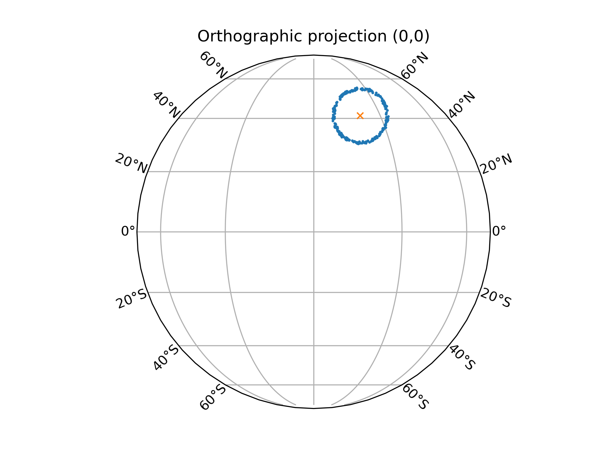

# Python limb darkening testing code for gCMCRT. 

Elspeth Lee - Sep 2021

Samples a random transit chord on the transit annulus - projects it back onto the stellar disk,
then calculates directly the stellar zenith angle of the chord,
then calculates the "exact" limb darkening coefficent for that chord given a limb darkening law.
Then makes some neato plots for the number of samples.

Parameters are fairly simple to edit in the python code. 

To run the code enter python lim_darkening_model_test.py into the terminal

NOTE: Requires cartopy to work: https://scitools.org.uk/cartopy/docs/latest/

This code may also be cool as a jupyter notebook...

